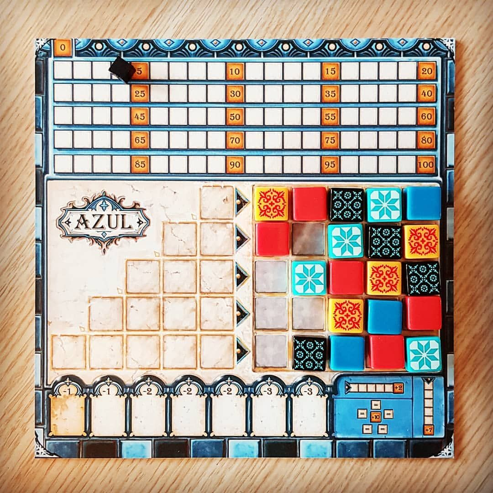

# Azul Project

 
    
 

 
The purpose of this project is to implement an autonomous agent that can play the game Azul and compete in the UoM COMP90054-2024 Azul competition. Here is the rules of the [Azul game](https://www.ultraboardgames.com/azul/game-rules.php). Azul can be understood as a deterministic, two-player game. Additional technical information on the contest project and how to get started can be found in file [azul.md](Azul/azul.md). 
